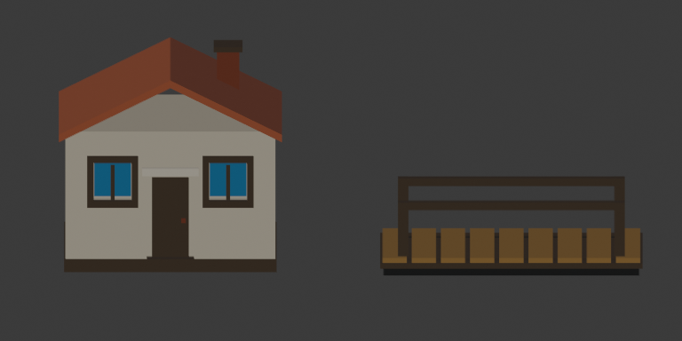

# Returning to a 2.5D world

## Recommendation

Test **real 3D terrain with 2D pixel characters**, keeping Cloverhollow's own
cozy palette, cast, and architecture. That is much closer to Cassette Beasts'
construction than either a flat painted background or a fully 3D character game.

This study is isolated on `prototype/2-5d-world-study`. Main remains the playable
2D game. A promising screenshot is not approval to port every level.

**[Open the current art showcase and movement clip](samples/cloverbrook-showcase/README.md).**
Run `just study-25d-play` on the study branch to try it yourself.
The [archived blockout](samples/park25d/README.md) records the first construction
sample. M230 adds textured terrain, authored foliage, upgraded architecture,
and scene dressing. Review that slice before deciding on a whole-game port.

## What Cassette Beasts actually does

Bytten's [Technical Look: The Park](https://www.cassettebeasts.com/2021/08/09/technical-look-the-park/)
explicitly calls it “a 3D game (or 2.5D if you like)” with a fixed camera,
grid-based terrain, Godot GridMap, and pixel-art characters. Their terrain tiles
were made in **Qubicle**, a voxel editor. Blender is a viable tool for our assets,
not a confirmed description of their original terrain workflow.

Their [New Wirral Park article](https://www.cassettebeasts.com/2020/09/25/new-wirral-park/)
and [open-world overview](https://www.cassettebeasts.com/2023/03/24/open-world/)
emphasize reachable surfaces, climbing, gliding, barriers, and loops. The third
dimension matters to route design, not just lighting.

The exact projection, sprite billboard mechanism, shadow settings, and
post-processing are not established by these sources. Orthographic projection
and Sprite3D billboards are our implementation hypotheses, not verified internals.
The [Godot showcase](https://godotengine.org/article/godot-showcase-cassette-beasts/)
also describes engine optimization work; its shipped scale should not be
mistaken for a free benefit of switching engines or checking a 3D box.

These references concern the original game's 2021–2023 development. The website
now also promotes a sequel, which is not the subject of this study.

## Strategy choices

| Approach | What it gives us | Tradeoff |
| --- | --- | --- |
| **3D terrain + pixel sprites** | Depth, real heights, shadows, bridges, reusable meshes; keeps existing character art | Needs a new spatial controller, careful sprite grounding and camera calibration |
| Pre-rendered backgrounds | Fast, attractive static composition; familiar 2D movement | Walk masks and fake height limit camera movement and vertical gameplay |
| Fully 3D characters/world | Consistent lighting and arbitrary camera movement | New character modeling, rigging and animation workload; not the closest visual match |

Use Blender for a small original modular prop kit and export GLB. Use Godot for
the actual terrain, collision, movement, camera, and lighting. No Qubicle purchase,
engine fork, world streaming system, or full character rewrite is needed for
this decision sample.

## What the first sample must show

- One small park with a water channel, bridge, ramp, raised ledge, cottage,
  vegetation, and an original pixel Fae.
- A playable lower/upper route, not a camera fly-through over inaccessible props.
- Identical composition points under orthographic and weak-perspective profiles.
- A moving example: walk, occlusion, elevation change, jump and landing.
- A stable contact shadow and feet seated on ground/bridge surfaces.
- Native 512x288 captures plus a short real-engine motion clip.

We judge silhouette, terrain depth, pixel scale, readability while moving,
shadow direction, and the usefulness of elevation. We are not evaluating a
finished town, final animation set, or complete quest chain.

## What carries over if the study is approved

Keep the narrative, content data, inventory/quest concepts, battle rules, most
UI, palette tooling, sprite source art, and evidence-based iteration workflow.
The current scenario isolation, failure detection, image review, and artifact
comparison remain useful.

Rework deliberately rather than silently adapting:

1. **Spatial player and camera:** CharacterBody3D movement, camera-relative
   facing, jump/elevation behavior, interaction reach and mobile input.
2. **World pipeline:** modular mesh dimensions, texture density, terrain edges,
   collision rules, roofs/occlusion, lighting and asset validation.
3. **Transitions and saves:** Marker3D placement, 3D return positions, and a
   versioned save migration rather than interpreting old Vector2 data as Vector3.
4. **One production slice:** home → town/park → encounter → battle return,
   including iOS performance checks, before expanding other levels.
5. **Content scale:** only then evaluate GridMap/MeshLibrary, chunk loading,
   navigation, and larger terrain tools. The study does not need them.

## Stop/go decision

Proceed only if the moving sample feels closer to the desired game, the sprite
and 3D environment look coherent together, and a real route remains readable.
If the camera or sprite scale is wrong, iterate this one scene first. If the
direction is rejected, the 2D main branch remains intact.

Reference images are kept locally under `captures/25d-study/references` for
study only. They are not copied into runtime assets or the sample artwork.

## Rebuilding the original prop kit



These are Blender asset previews, not gameplay screenshots. The chimney and
rail posts deliberately seat into their supporting surfaces; the generator
measures those overlaps.

The committed GLBs run without Blender. To regenerate the source kit with
Blender 5.0.1, from the repository root:

```bash
blender --background --factory-startup --python tools/art/build_25d_study_assets.py
```

Godot's [asset-format documentation](https://docs.godotengine.org/en/4.5/tutorials/assets_pipeline/importing_3d_scenes/available_formats.html)
distinguishes direct `.blend` imports, which require Blender, from runtime
glTF/GLB imports. The authoring-only `art/source` directory uses Godot's
[folder-scoped `.gdignore` marker](https://docs.godotengine.org/en/4.5/tutorials/best_practices/project_organization.html)
to keep those Blender sources out of resource scanning.

The builder owns `P25D_` collections, reads `art/recipes/park25d.json`, and writes
the cottage/bridge sources under `art/source/park25d`, runtime GLBs under
`game/assets/studies/park25d`, and measurements/views under
`captures/25d-study/assets`. Run it in a fresh background Blender process as
shown, not inside an unrelated working scene.

The cottage wall body is 3.2 × 2.4 metres and 2.2 metres high. Its roof ridge is
3.05 metres high; the chimney extends above that. The bridge is 4 × 2 metres,
with its deck at 0.16 metres and rail tops at 1 metre. These are authoring
contracts, not total cottage bounding-box dimensions including eaves/chimney.
Godot `(X,Y,Z)` maps from Blender `(X,Z,-Y)`.

Checks run before export for body dimensions, roof/bridge heights, actual
facade pocket ray hits, intentional chimney/rail overlaps, planar faces,
closed meshes, and positive signed mesh volumes. The study's Godot collision
shapes remain separately authored and must also pass traversal tests. Asset
measurements alone do not establish gameplay collision correctness.
