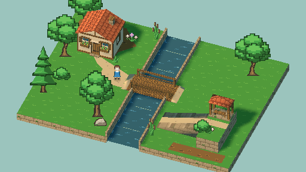
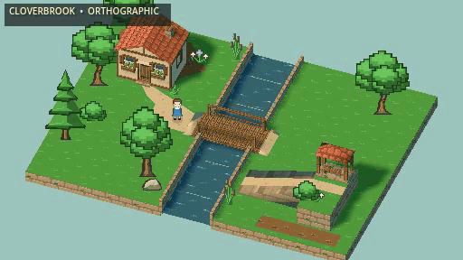
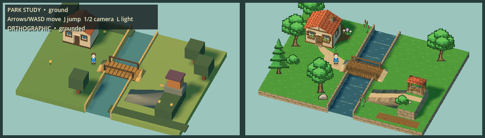
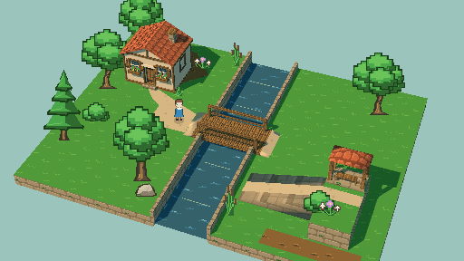
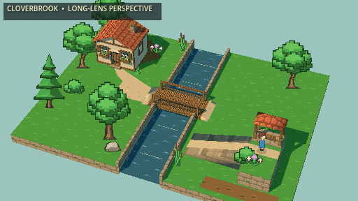
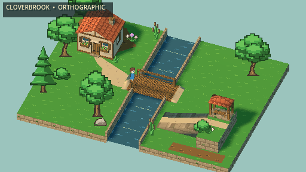

# Cloverbrook Footbridge art showcase

A representative Cloverhollow location using pixel-art characters and foliage
in a textured 3D world. This M230 art pass builds on the M229 movement study.



## See it move



**[Watch/download the MP4](walkthrough.mp4)**: 12 seconds, 1024×576,
60 FPS, H.264, no audio. The source is a 512×288 Godot MovieMaker recording,
enlarged with nearest-neighbor sampling. The GIF is a native-size 15 FPS
preview. Neither is a slideshow, a Blender beauty render, or a performance
benchmark.

## Before and after

Left: M229 technical blockout. Right: the M230 art pass.



The pass adds original foliage silhouettes, eight pixel material textures,
timbered architecture, roof shingles, recessed windows and window boxes,
detailed bridge planking, masonry banks, stream-edge treatment, and a covered
garden lookout. The same physical bridge/ramp route remains playable.

## Camera comparison

| Orthographic | Long-lens perspective |
| --- | --- |
|  |  |
|  |  |

Each row uses the same player position. Hero views hide helper chrome; other
views retain the compact area/projection label. These are our camera choices,
not claims about Cassette Beasts' exact settings.



## Play locally

```bash
git switch prototype/2-5d-world-study
just study-25d-play
```

**WASD/arrows** move, **J** jumps, **1/2** switch cameras, **L** toggles the key
light, and **H** hides/shows the helper chrome. The launcher imports committed
GLBs and isolates save/settings data. Blender is only needed to rebuild assets.

## Scope and remaining work

This is an art-direction slice, not a finished game or a port of the existing
levels. Foliage and water are currently static. Texture repetition remains
visible, and larger-world composition, ambient animation, interaction content,
mobile controls, and iOS performance still need production work.

The tested route includes bridge crossing, ramp ascent/descent, jump/landing,
and the west-bank return. Water/cliff walking checks pass. Jumping over low
water walls or bridge rails is outside the supported route; fall recovery is
not implemented, so relaunch if you leave the terrain.

Main remains the existing 2D game. Nothing here authorizes its replacement.

## Evidence

- Native frames: `captures/m230/final-camera` and `captures/m230/final-walk`.
- Movie source and route trace: `captures/m230/final-movie`.
- Reviewed camera sheet: `captures/m230/final-camera-sheet.png`.
- Reviewed motion sheet: `captures/m230/final-motion-sheet.png`.
- Godot 4.5.1, seed 12345, local Forward+ / Metal rendering.
- The source movie contains 900 frames at 60 FPS. The published clip retains
  the first 720 frames; the return checkpoint occurs before the trim ends.

Raw runs are ignored local artifacts. These curated frames and clips are
committed for review, not promoted as regression baselines.

[Art direction](../../cloverbrook-art-direction.md) ·
[Asset reproduction](../../park25d-m230-art-pass.md) ·
[Milestone evidence](../../../working-sessions/m230-showcase.md) ·
[Archived M229 blockout](../park25d/README.md)
