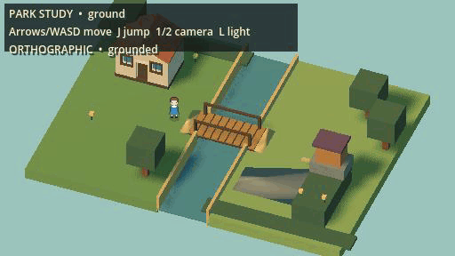
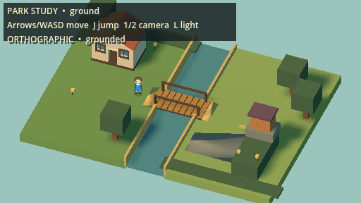
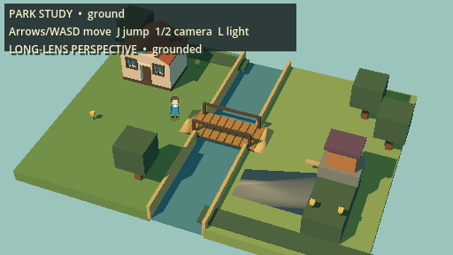
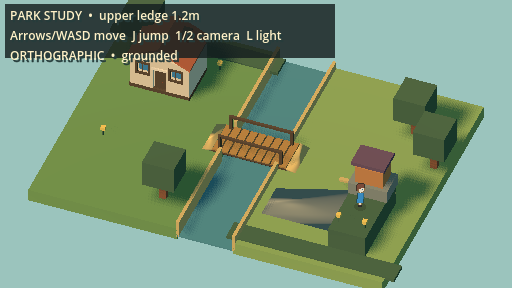

# Cloverhollow 2.5D direction sample

This is an original **technical art blockout**, not finished art or a whole-game
conversion. It tests 3D terrain with pixel Fae, physical elevation, a bridge,
camera-relative movement, and two fixed camera projections.

## Watch it move



[Watch/download the 12-second MP4](walkthrough.mp4). The MP4 is 60 FPS and
nearest-neighbor enlarged to 1024×576. The inline GIF is a 15 FPS preview at
512×288. Both come from the same Godot MovieMaker recording, not a slideshow.

## Compare cameras

| Orthographic | Long-lens perspective |
| --- | --- |
|  |  |
|  |  |

Each row uses the same world and player position. Orthographic is the current
default; perspective uses a 20° field of view. These are Cloverhollow
experiments, not claims about Cassette Beasts' exact camera settings.

## Play locally

```bash
git switch prototype/2-5d-world-study
just study-25d-play
```

WASD/arrows move, **J** jumps, **1/2** switch cameras, and **L** toggles the key
light. The launcher imports the committed GLBs and uses isolated save/settings
data. Blender is needed only to rebuild the original props, not to play.

## What to judge

- Do physical heights and movement feel like the right direction?
- Does pixel Fae belong in the 3D environment?
- Which camera feels more readable?

The terrain and trees are still simple flat-shaded blocks. Texture detail,
foliage silhouettes, contact-shadow refinement, and a richer town composition
need an art pass before judging production quality. No iOS performance, save
migration, quest progression, or battle-return claim is made here.
The tested route is walkable in both directions. Jumping over the low bridge
rails or water retaining walls is not a supported route, and this prototype
does not yet have fall recovery. Relaunch the sample if you leave the terrain.

## Evidence and reproduction

Captured with Godot 4.5.1, seed 12345, local Metal renderer. Native stills come
from `captures/25d-study/showcase-camera`. The movie source and passing route
trace are in `captures/25d-study/showcase-movie`. It records 900 frames at 60 FPS;
the published clip retains the first 720 frames. The complete return checkpoint
occurs before the trim ends. Audio was omitted from the preview.

```bash
just study-25d
just study-25d-rendered
QUIT_AFTER_FRAMES=900 just study-25d-record
```

The raw capture directories are local ignored artifacts; these curated samples
are committed so they can be reviewed without running Godot. They are not
regression baselines. [Research and migration recommendation](../../25d-direction-study.md).
